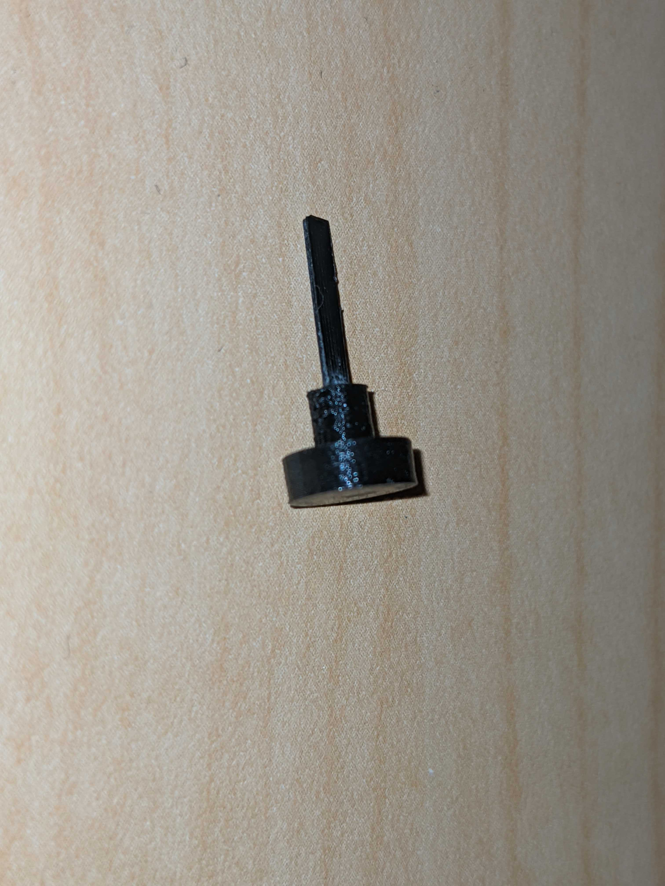
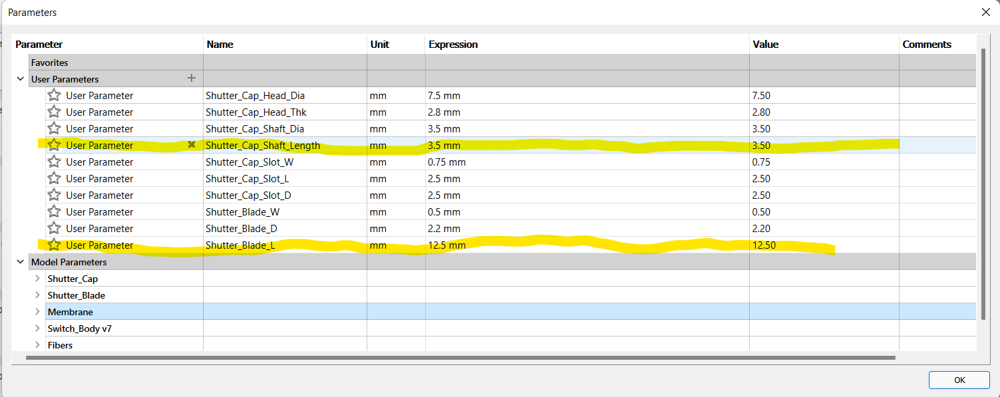
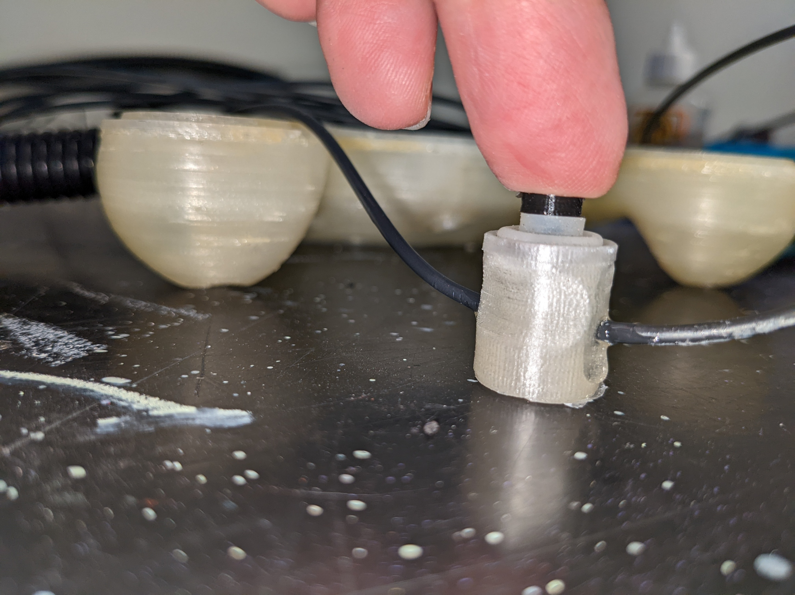
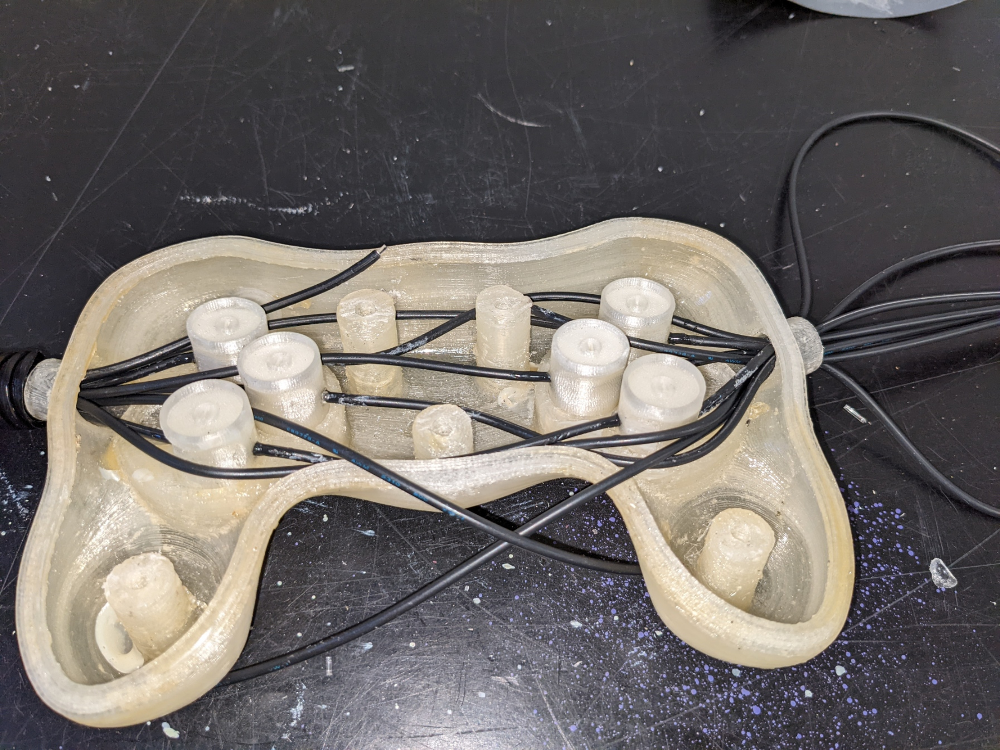
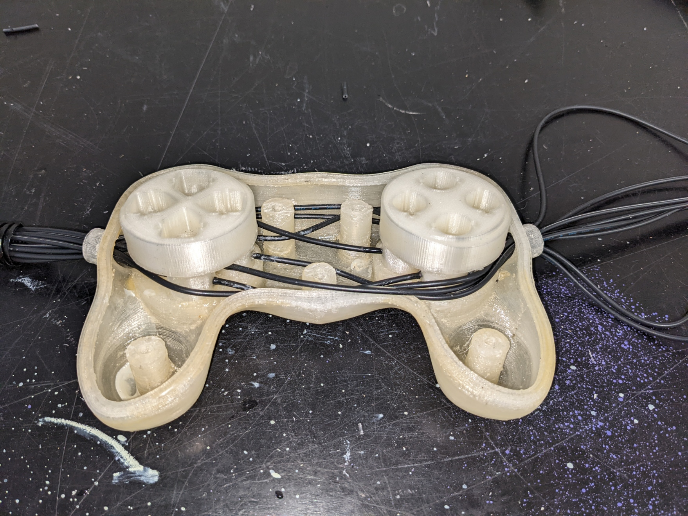
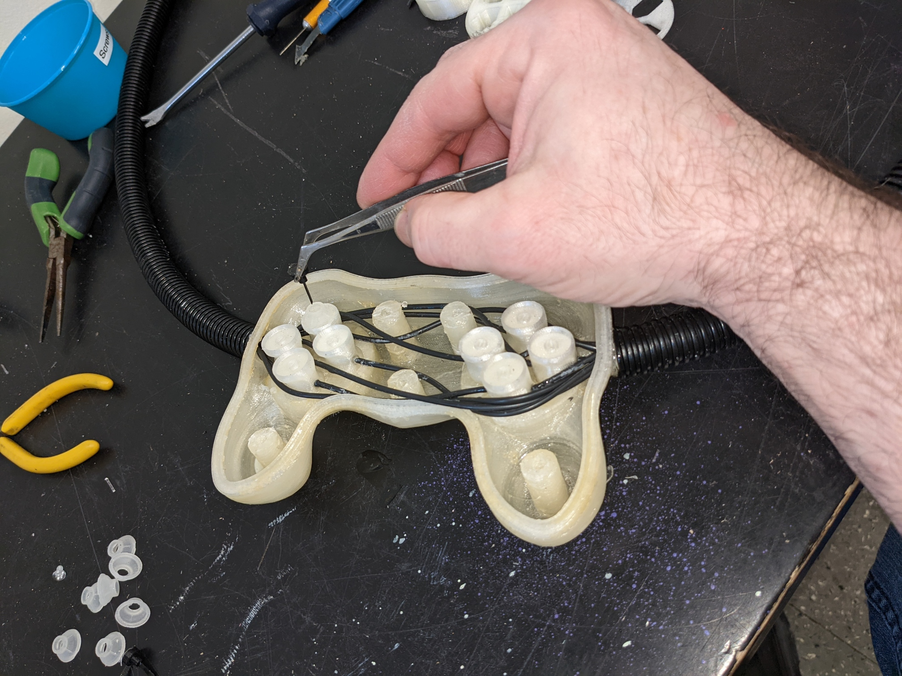
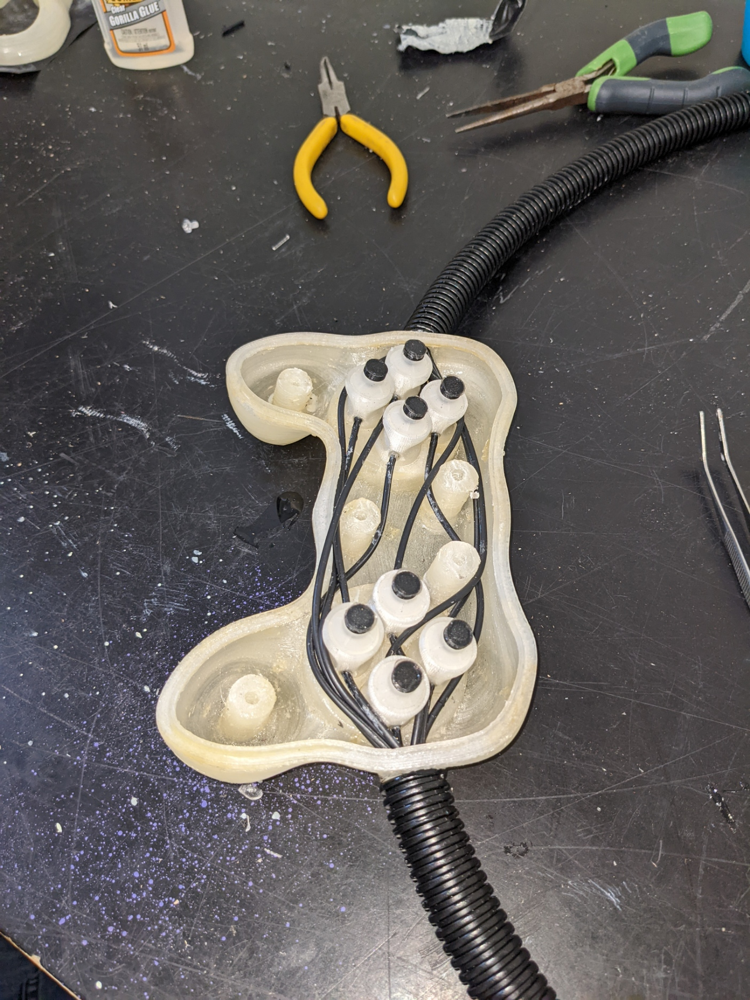
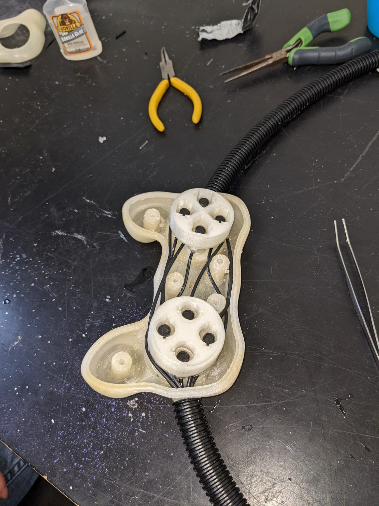
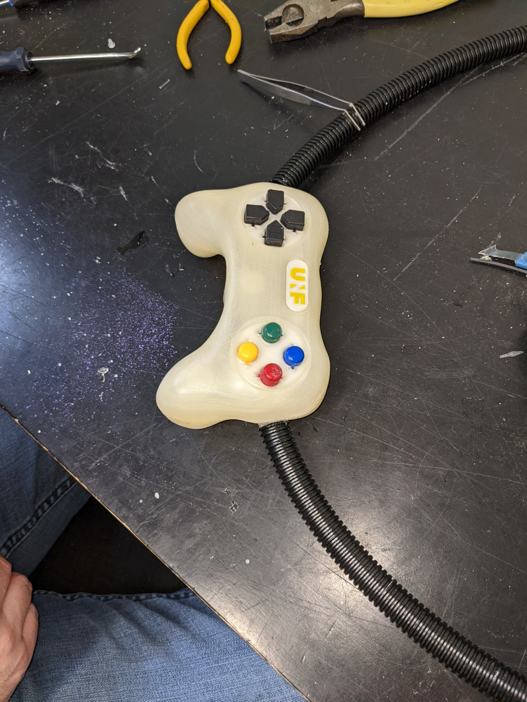

# Building the controller body

This document describes the steps necessary to build and assemble the hand-held controller body part.

## Assembly

### Optical switches

#### Shutter assembly

Required:

Parts
  - Shutter_Blade x 8
  - Shutter_Cap x 8
  - Switch_Body x 8

Tools
  - Cyanoacrylate adhesive
  - Fine sanding paper or files
  - X-acto knife

Check both shutter blade and shutter cap for smoothness of surface and file or sand any rough surface. Test insertion of blade into slot at the bottom of shutter cap. It should slide to the bottom easily but you should still feel a bit of resistance. Put a drop of cyanoacrylate adhesive on a liquid tight surface, dip the end of shutter blade in adhesive and insert into slot at bottom of shutter cap.

Shutter assembly drawing | Shutter assembly exemple
---|---
 |

#### Switch assembly

1. Disassemble a discarded computer keyboard to recuperate the membrane making the rubber dome switches. Individually cut away the switch dome parts and remove centre of top surface using an x-acto knife.

2. Test assembly of shutter, membrane and switch body by inserting the shutter by inserting the shutter blade into the empty centre part of rubber dome, then into gap at the top of switch body. The shutter blade should completely occult the guide hole for the fiber optic when button is pressed down, but leave it free when in upward position. The distance between the bottom
 of the shutter cap and the top of switch body will determine the stroke length of the key. The smaller this distance, the more responsive the controls will be. The shutter should move freely up and down.

 

 Shutter up | Shutter pressed down
 ---|---
  |

 3. Since the rubber domes recuperated from computer keyboards will very likely vary in dimensions, it might be necessary to modify shutter cap and shutter blade dimensions. The file [Shutter_Assembly_Param.f3d](CAD/f3d/Shutter_Assembly_Param.f3d) contains these two parts in Autodesk Fusion 360 format. The design is parametric to facilitate modifications. To edit the parts, open the file in **Fusion 360**, go to Modify, then select change parameters and expand User Parameters. Changing the value of parameter *Shutter_Cap_Shaft_Length* will allow to adjust the stroke length, while changing *Shutter_Blade_L* will allow ensuring correct shutter operation. That part is also available in [.step](/CAD/stp/Shutter_Cap.step) format for import in other CAD programs.

 

4. Ensure that the air gap and the fiber optic guide in the 3D printed switch bodies are free of any residual PLA or support material. Hold switch body in front of a light source and check along Z axis for the air gap, and along horizontal axis for the fiber optic guide.

### Controller body

1. For each control on the controller, cut one length of duplex fiber optic to desired length between controller and interface module + 150 mm
2. Split each length of fiber on its length to separate the 2 fibers on a distance of approx. 750 mm from one end, and 25 mm from second end
3. Label each fiber with the name of matching control. On the end where the fibers are split for the largest distance (controller end) place a label on each single fiber
4. On the controller side of the fibers, make two bundles of fibers. Place one fiber of eac78h control in either bundle.
5. For one of the two bundles, cut the fibers for the directional pad controls about 150 mm shorter than the ones for the buttons. Do the opposite with the other bundle. This will allow a cleaner layout of the fibers inside the casing.
6. Strip and polish fibers **(need procedure)**
7. Cut two 500 mm lengths of the 13 mm ID plastic hose and fix those on the ends of the Y splitter
8. Fix second end of plastic hoses to extrusions on part *Casing_Bottom*

Fiber_Sheath_Assembly

9. For each control, place a *Switch_Body* in matching groove inside casing.

10. Insert the fiber optics into Y splitter and push gently until both fibers emerge inside of casing. The bundle where the buttons fibers are longer will go on the directional pad side. There will be one fiber for each control in each branch of the Y. Make sure that the length protruding inside the casing is enough to reach into the corresponding *Switch_Module* and allow to lay out cleanly inside casing.
11. For each control, glue both fibers in place **(Need glue specs)**
12. Optional: Depending on fit tightness of *Switch_Module* parts inside grooves, it is also possible to glue the module in place. If gluing modules in place, wait for glue on fibers to set before proceeding
13. Place one threaded Nylon insert in each mounting post of part *Casing_Top*. If inserts don't fit inside, re-drill hole using 1/4" (6.35 mm) bit. If inserts are loose, use a drop of cyanoacrylate adhesive

 

14. Before starting assembly, test bottom and top parts of casing for fit. The two halves should fit together without any visible gap. Common area that might need post processing are the top and bottom of screw posts and the lip that runs around the perimeter of the bottom part, as well as the matching flat surface on the top part. If necessary, file or sand away excess of material that might prevent case from closing properly.

 
Test casing for fit

 | 
Areas commonly requiring post-processing

### Optical fibers assembly
 
Parts ready for assembly

1. Separate bundle of fiber optics into two smaller bundles of 8 fibers each. Pull each smaller bundle through the Y splitter with one small bundle coming out of each of the Y branches. Pull each of the smaller bundle into the 1 meter protective sheath until there is approximately 300 mm of fibers coming out of each sheath.

 
Separating fibers bundle with Y splitter

2. Pull each bundle into the bottom part of casing through openings on the sides and make sure that the sheaths fit nicely on the protruding parts and that you have at least 200 mm length of fibers going into the casing on both sides.

 
Fibers insertion in casing

3. Strip fibers and polish the fibers. It's possible to use a regular wire stripping tool set for #18 wire size. Insert fibers into switch body so teh tip of the fiber is flush with the internal wall of the air gap. Ensure that the shutter is free to move after the fibers are in place.
4. Use a drop a glue to affix the fibers to the switch body. The type of glue is not critical, but **do not use** cyanoacrylate or other type of _permanent_ glue. These will work, but they will make the switch impossible to repair, which means in case of a broken fiber or other problem, you will need to replace the whole switch.

 

 
Fibers connections and testing

5. To assemble the switch inside the casing, it is easier to proceed by pairs, waiting for the glue on the fibers to set before proceeding to the next pair. Proceeding that way allows to move the fibers around to route them cleanly inside the casing without pulling them out from the body of already installed switches. The order is not critical, but it is a lot easier to finish with the pair that's the closest to the opening where the fibers enter the casing.

 
Assembling first pair of controls

 
Assembling second pair of controls

 
Assembling third pair of controls

 
Assembling fourth pair of controls

 
Add buttons supports

 
Installing rubber membranes and shutters

 
Finished view

 
Re-install buttons supports

 
Close casing

 
Casing closed top view

 
Install buttons

 
Finished view

 
Install direction pad cover and buttons cover

 
Assembly complete
